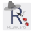
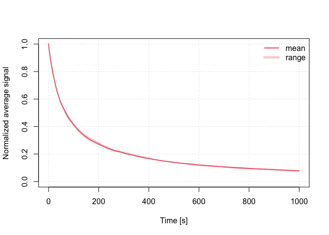

<!-- README.md was auto-generated by README.Rmd. Please DO NOT edit by hand!-->

# RLumCarlo 

The **R** package ‘RLumCarlo’ provides a collection of various R
functions modelling luminescence signals using Monte Carlo methods.

[](https://www.repostatus.org/#concept)
[](https://cran.r-project.org/package=RLumCarlo)
[](http://www.r-pkg.org/pkg/RLumCarlo)
[](https://travis-ci.com/R-Lum/RLumCarlo)
[](https://codecov.io/gh/R-Lum/RLumCarlo)

## Installation

#### i. Requirements

Depending on your OS please download and install one of the following:

**Windows (32/64bit)** - ‘Rtools’ (provided by CRAN)

<https://cran.r-project.org/bin/windows/Rtools/>

**Mac OS X** - ‘Xcode’ (provided by Apple)

<https://developer.apple.com/xcode/downloads/>

For **Linux** users *gcc* often comes pre-installed in most
distributions. Should *gcc* be not available, however, we kindly refer
to the exhaustive collection of installation guides depending on the
linux distribution.

#### ii. Install the package

To install the latest development builds directly from GitHub, run

``` r
if(!require("devtools"))
  install.packages("devtools")
devtools::install_github("R-Lum/RLumCarlo@master")
```

To install a developer build other than ‘master’, replace the term
‘master’ in the codeline by the name of the wanted developer build
(not available yet).

## Examples

### Simulating CW-IRSL measurements

``` r
run_MC_CW_IRSL_TUN(A = 0.12, rho = 0.003, times = 0:1000) %>%
     plot_RLumCarlo(norm = TRUE, legend = TRUE)
```



## Note

**The package comes without any guarantee\!**

Please further note that this version is a development version and may
change day by day. For stable branches please visit the package on CRAN.

## License

This program is free software: you can redistribute it and/or modify it
under the terms of the GNU General Public License as published by the
Free Software Foundation, either version 3 of the License, or any later
version.

This program is distributed in the hope that it will be useful, but
WITHOUT ANY WARRANTY; without even the implied warranty of
MERCHANTABILITY or FITNESS FOR A PARTICULAR PURPOSE. See the [GNU
General Public
License](https://github.com/R-Lum/RLumCarlo/blob/master/LICENSE) for
more details.

## <span class="glyphicon glyphicon-euro"></span> Funding

This project benefitted from the support by various funding bodies.

  - The initial work by Johannes Friedrich, Sebastian Kreutzer and
    Christoph Schmidt was supported by the [DFG (2015–2018,
    SCHM 3051/4-1, “Modelling quartz luminescence signal dynamics
    relevant for dating and dosimetry”, SCHM
    3051/4-1)](https://gepris.dfg.de/gepris/projekt/279969851).

  - Later financial support was secured through the project *ULTIMO:
    Unifying Luminescence Models of quartz and feldspar (German Academic
    Exchange Service) DAAD: Deutscher Akademischer Austauschdienst DAAD
    PPP USA 2018, ID: 57387041)*.

  - The work of Sebastian Kreutzer as maintainer of the package was
    supported by [LabEx LaScArBx (ANR -
    n. ANR-10-LABX-52)](https://lascarbx.labex.u-bordeaux.fr).

## Related projects

  - [Luminescence](https://github.com/R-Lum/Luminescence)
  - [RLumModel](https://github.com/R-Lum/RLumModel)
